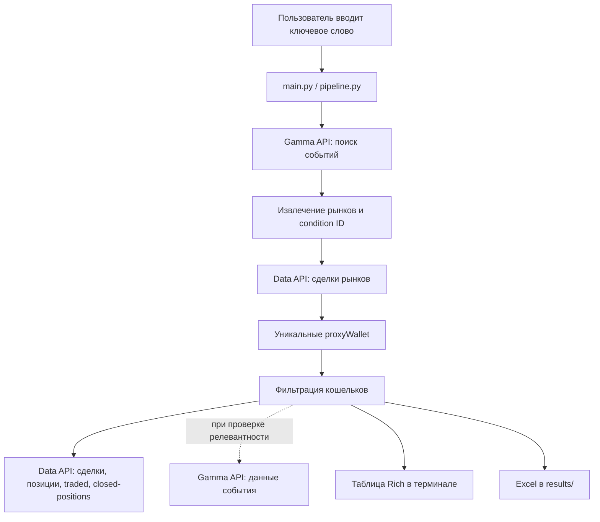

# InsiderFinder

Интерактивная CLI-утилита для поиска кошельков Polymarket, торгующих рынками по заданной теме, и фильтрации кандидатов по активности, числу рынков, открытым позициям и реализованному PnL.

## Overview

InsiderFinder обращается к публичным API Polymarket: Gamma API используется для поиска событий и уточнения их релевантности, Data API — для получения сделок и статистики кошельков. Приложение не принимает HTTP-запросы и не предоставляет собственного API.

Рабочий процесс запускается из терминала. Пользователь вводит ключевое слово, программа находит события и их рынки, собирает уникальные адреса из сделок, применяет критерии из `config.yaml`, показывает результаты и сохраняет их в файл Excel.

## Features

- Асинхронный поиск событий по ключевому слову и сбор рынков из найденных событий.
- Сбор уникальных адресов `proxyWallet` из сделок рынков.
- Фильтрация кошельков по времени последней сделки, количеству торговавшихся рынков и текущих позиций.
- Дополнительные критерии по реализованному PnL и релевантности закрытых позиций ключевому слову.
- Отображение прогресса и сводной таблицы в терминале.
- Экспорт прошедших фильтрацию кошельков в `results/wallets_<timestamp>.xlsx` со ссылками на профили Polymarket и Hashdive.

## Tech Stack

- **Python 3.14+** — версия указана в `.python-version` и `pyproject.toml`.
- **aiohttp** — асинхронные HTTP-запросы.
- **Rich** — прогресс и вывод в терминале.
- **PyYAML** — чтение `config.yaml`.
- **pandas** и **openpyxl** — создание и форматирование Excel-файлов.
- **fake-useragent** — генерация User-Agent для прокси.
- **uv** — зависимости и lock-файл `uv.lock`.
- **Внешние сервисы:** Polymarket Gamma API и Polymarket Data API. База данных, очередь и отдельное хранилище не используются.

## Architecture



Поиск событий выполняется напрямую. Получение сделок и проверка кошельков используют список прокси из `src/utils/constants.py`; User-Agent для них подбирает `src/utils/proxy_manager.py`.

## Project Structure

```text
.
├── main.py                    # CLI entry point
├── config.yaml                # Пороговые значения фильтрации
├── pyproject.toml             # Метаданные проекта и Python-зависимости
├── uv.lock                    # Зафиксированные версии зависимостей
└── src/
    ├── pipeline.py            # Последовательность поиска, сбора, фильтрации и экспорта
    ├── core/
    │   ├── scan_keyword.py    # Поиск событий и извлечение рынков
    │   ├── scan_trades.py     # Сбор сделок и адресов кошельков
    │   └── scan_wallets.py    # Проверка активности и фильтры кошельков
    └── utils/
        ├── config_loader.py   # Загрузка YAML-конфигурации
        ├── constants.py       # API URL, встроенные значения по умолчанию и список прокси
        ├── proxy_manager.py   # Связка прокси с User-Agent
        ├── interface.py      # Консольный интерфейс и прогресс
        └── export_excel.py   # Запись результата в XLSX
```

## Requirements / Prerequisites

- Python **3.14 или новее**.
- Установленный `uv` для установки зависимостей по lock-файлу.
- Доступ к интернету и Polymarket API.
- В текущем коде используются прокси, список которых встроен в `src/utils/constants.py`. Перед запуском проверьте и замените этот список на собственные доступы либо удалите прокси из исходника, если хотите выполнять запросы напрямую. Переменной окружения для настройки прокси нет.

Ключ API Polymarket и локальная база данных кодом не настраиваются. В репозитории нет Docker-конфигурации.

## Installation

Выполняйте команды из корневой директории клона:

```bash
uv sync --locked
```

Команда создаёт окружение проекта и устанавливает зависимости из `uv.lock`. Файл `.python-version` указывает Python 3.14.

## Configuration

Приложение читает `config.yaml` относительно текущей рабочей директории. Запускайте его из корня репозитория. В файле уже заданы рабочие значения; после изменения конфигурации перезапуск программы применяет их.

| Параметр | В `config.yaml` | Встроенное значение | Назначение |
|---|---:|---:|---|
| `max_events_to_search` | `50` | `50` | Максимум событий, которые программа обрабатывает по результатам поиска. |
| `max_trades_per_market` | `50000` | `50000` | Порог обхода сделок на рынок; API опрашивается страницами по 500 записей, параллельно для нескольких прокси, поэтому фактический объём может отличаться от значения. |
| `last_active_trade` | `"1d"` | `"1d"` | Насколько недавно должна быть совершена последняя сделка. Поддерживаются суффиксы `h`, `d`, `w` (часы, дни, недели), например `12h` или `7d`. |
| `min_predictions` | `2` | `1` | Минимальное число рынков, возвращаемое статистикой `traded`. |
| `max_predictions` | `50` | `50` | Максимальное число рынков из статистики `traded`. |
| `current_positions` | `50` | `50` | Максимальное число текущих позиций размером больше `0.01`. |
| `realized_pnl` | `1000` | `1000` | Минимальный суммарный реализованный PnL в USD. |
| `target_keyword_percent` | `0.5` | `0` | Порог релевантности закрытых позиций ключевому слову: `0.5` соответствует 50%; `0` отключает проверку. Используйте значение от `0` до `1`. |

Отдельной поддержки `.env` и переменных окружения в коде нет. При ошибке чтения или синтаксиса YAML программа выводит сообщение и использует встроенную конфигурацию.

Для числовых параметров загрузчик принимает только числа не меньше нуля и не принимает `null` для `current_positions` или `realized_pnl`: в этом случае останется встроенное значение. Хотя код фильтрации умеет обрабатывать `None`, отключить эти два критерия только через `config.yaml` сейчас нельзя.

**Ограничение `target_keyword_percent`:** закрытые позиции загружаются страницами по 50 записей, но текущий код делит накопленное число совпадений на размер последней страницы. Если страниц больше одной, фактическая проверка порога может быть некорректной.

**Прокси:** адреса прокси заданы непосредственно в `src/utils/constants.py`, а не в `config.yaml`. На первом запуске `src/utils/proxy_manager.py` создаёт `proxies_config.json` с назначенными User-Agent; файл исключён из Git через `.gitignore`. Он содержит ключи прокси, поэтому не публикуйте его.

## Running the Project

Запустите CLI из корня репозитория:

```bash
uv run main.py
```

Введите ключевое слово в появившемся приглашении. После завершения программа показывает результаты и, если найдены прошедшие фильтрацию кошельки, записывает Excel-файл в `results/`. При первом запуске терминальный интерфейс может очистить экран.
